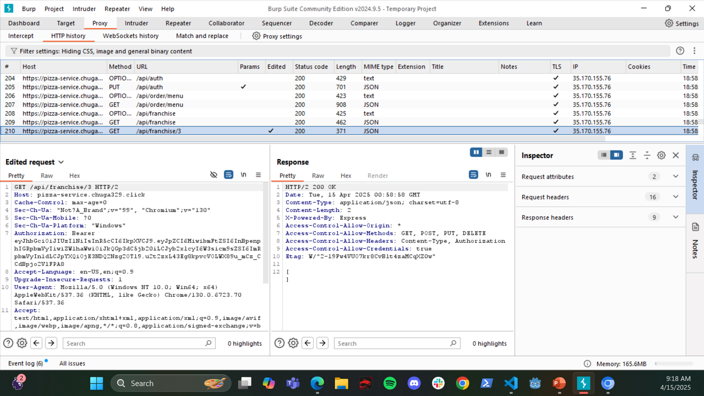
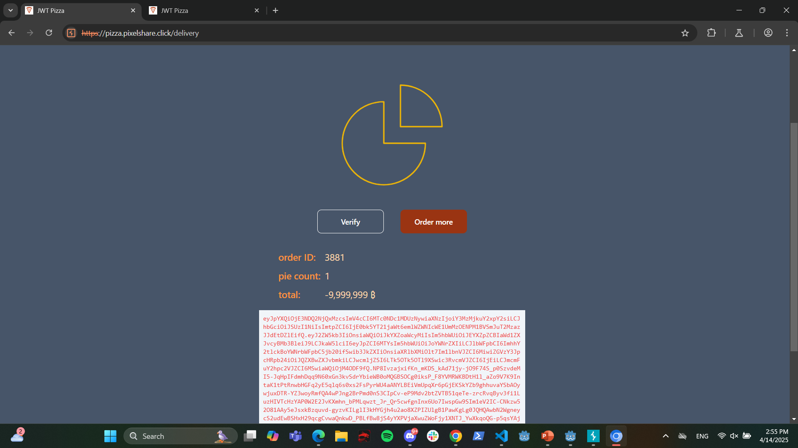

# Security Findings Report

**Analyst**: Cole Strong  
**Date**: April 14, 2025

---

## 🧨 Self Attacks

### Broken Access Control - Franchise Listing

| Field              | Details                                                                                                                                                                                        |
| ------------------ | ---------------------------------------------------------------------------------------------------------------------------------------------------------------------------------------------- |
| **Target**         | `pizza.chuga329.click`                                                                                                                                                                         |
| **Classification** | Broken Access Control                                                                                                                                                                          |
| **Severity**       | 4                                                                                                                                                                                              |
| **Description**    | Requesting a list of franchises for any user ID returns a list (though it is empty if you are not the franchise owner). It SHOULD be unauthorized. A more skilled attacker could exploit this. |
| **Corrections**    | Ensure the Bearer Token belongs to the `userId` during the `GET` request.                                                                                                                      |
| **Images**         |    Returning and empty list instead of declaring unauthorized.                                                                                   |

---

### Injection - SQL Injection

| Field              | Details                                                                                                                                                                           |
| ------------------ | --------------------------------------------------------------------------------------------------------------------------------------------------------------------------------- |
| **Researcher**     | David Higueros                                                                                                                                                                    |
| **Date**           | April 11, 2025                                                                                                                                                                    |
| **Target**         | `pizza.pixelshare.click`                                                                                                                                                          |
| **Classification** | Injection                                                                                                                                                                         |
| **Severity**       | 2                                                                                                                                                                                 |
| **Description**    | User update requests (and other endpoints) use string concatenation in SQL queries. This creates vulnerabilities to SQL injection, potentially allowing attackers to drop tables. |
| **Corrections**    | Use prepared statements with parameter binding for all database queries.                                                                                                          |

---

## 🤝 Peer Attacks

### Broken Access Control - Price Altering

| Field              | Details                                                                                                                           |
| ------------------ | --------------------------------------------------------------------------------------------------------------------------------- |
| **Researcher**     | Cole Strong                                                                                                                       |
| **Date**           | April 14, 2025                                                                                                                    |
| **Target**         | `pizza.pixelshare.click`                                                                                                          |
| **Classification** | Broken Access Control                                                                                                             |
| **Severity**       | 1                                                                                                                                 |
| **Description**    | Using Burp Suite, the price of orders can be altered — even made negative — which could theoretically credit money to a customer. |
| **Corrections**    | Only accept pizza types and counts in requests. Retrieve prices from the database and calculate totals server-side.               |
| **Images**         |    Cost of order is manipulated.                                                           |

---

### Security Misconfiguration - Default Admin Left In

| Field              | Details                                                                                                                                                                                         |
| ------------------ | ----------------------------------------------------------------------------------------------------------------------------------------------------------------------------------------------- |
| **Researcher**     | David Higueros                                                                                                                                                                                  |
| **Date**           | April 14, 2025                                                                                                                                                                                  |
| **Target**         | `pizza.chuga329.click`                                                                                                                                                                          |
| **Classification** | Security Misconfiguration                                                                                                                                                                       |
| **Severity**       | 3                                                                                                                                                                                               |
| **Description**    | Default Admin, Franchisee, and Diner accounts were left in the database, allowing login using known credentials. While this may not be present in production, it's a critical issue if left in. |
| **Corrections**    | Delete all default users and accounts from the database.                                                                                                                                        |

---

## 🧠 Other Notes

### Insecure Design - Predictable IDs

| Field              | Details                                                                                                                                   |
| ------------------ | ----------------------------------------------------------------------------------------------------------------------------------------- |
| **Date**           | April 14, 2025                                                                                                                            |
| **Target**         | `pizza.chuga329.click`                                                                                                                    |
| **Classification** | Insecure Design                                                                                                                           |
| **Severity**       | 3                                                                                                                                         |
| **Description**    | UserID, FranchiseID, etc., are auto-incremented starting at 1. An attacker could iterate through IDs to gather data or exploit endpoints. |
| **Corrections**    | Use randomized or hashed IDs to reduce predictability and increase security.                                                              |

---

### Identification & Authentication Failure - Bearer Tokens Left In

| Field              | Details                                                                                                      |
| ------------------ | ------------------------------------------------------------------------------------------------------------ |
| **Date**           | April 14, 2025                                                                                               |
| **Target**         | `pizza.chuga329.click`                                                                                       |
| **Classification** | Identification and Authentication Failures                                                                   |
| **Severity**       | 4                                                                                                            |
| **Description**    | Bearer tokens persist in the database if users don’t log out, allowing continued use past a safe time frame. |
| **Corrections**    | Implement token expiration — for example, invalidate after 3 hours of inactivity.                            |

---

## Summary

As peers we spent several hours, both separate and together, attempting penetration tests and logging our findings. What we determined is that there are multiple points where our code is potentially weak, but that exploiting it requires more experience and time than we had. We were able to find a severe issue with the pricing being sent through http requests to the server and had a good discussion about making sure that the user is limited in what they have access to both seeing and sending the server. We also determined multiple other vulnerable points that could be very hazardous if someone more experienced than ourselves were to exploit them. Most of these could be solved through hashing, making sure that tests and users information is private, and doing most of the logic on the backend.
Throughout our conversation we came to the conclusion that security needs to be a mindset that is held throughout the entire process-from the very beginning of the dev stage, and carried throughout the lifetime of the product. Going back and fixing issues that have to do with the core structure of the code is incredibly challenging and time consuming, so it's best to figure it out before we make it. Not only that, but the world of computer science grows and adapts at such a rate that there will always be new forms of security necessary to keep a stable platform. We had a lot of fun with this deliverable and it was an eye opening experience!

---
